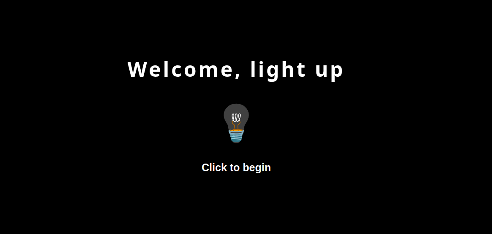
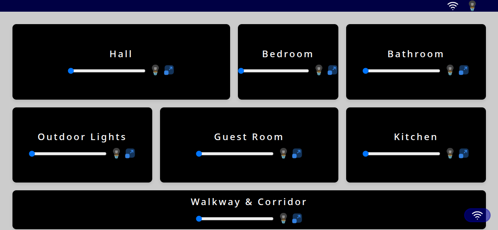

# Statically Strict Debugger

This project is a smart home simulation interface, initially developed using JavaScript and subsequently refactored to TypeScript for improved type safety and maintainability.

## Project Description

The application simulates controlling various components within a home environment, such as lights and potentially other devices. It provides a user interface to interact with these components and visualize their status and usage. The refactoring from JavaScript to TypeScript was undertaken to leverage static typing, which helps catch errors early in the development process and enhances code readability and structure.


## Screenshots

Here are some mock screenshots of the application:




## Getting Started

(Add instructions on how to set up and run the project here)

## Testing

Unit tests for the project are located in the `test` folder. These tests are written using Jest and are configured to run with JSDOM to simulate a browser environment.

To run the tests, use the following command:

```bash
npm test
```

The test suite includes tests for the `basicSettings.js`, `advanceSettings.js`, and `general.js` files. A placeholder test is included for `main.js` due to the complexity of testing DOM manipulation and event listeners.

## Git Workflows

This project follows a simple Git workflow:

1.  **Branching:** Work is done on feature branches created from the `main` branch.
2.  **Commits:** Commits should be descriptive and follow a clear convention (e.g., `feat: add new feature`, `fix: resolve bug`).
3.  **Pull Requests:** Changes are submitted via pull requests to the `main` branch. Code reviews are encouraged before merging.
4.  **Merging:** Feature branches are merged into `main` after approval.
5. **Github action** Test are automatically run when pushed to the main branch

