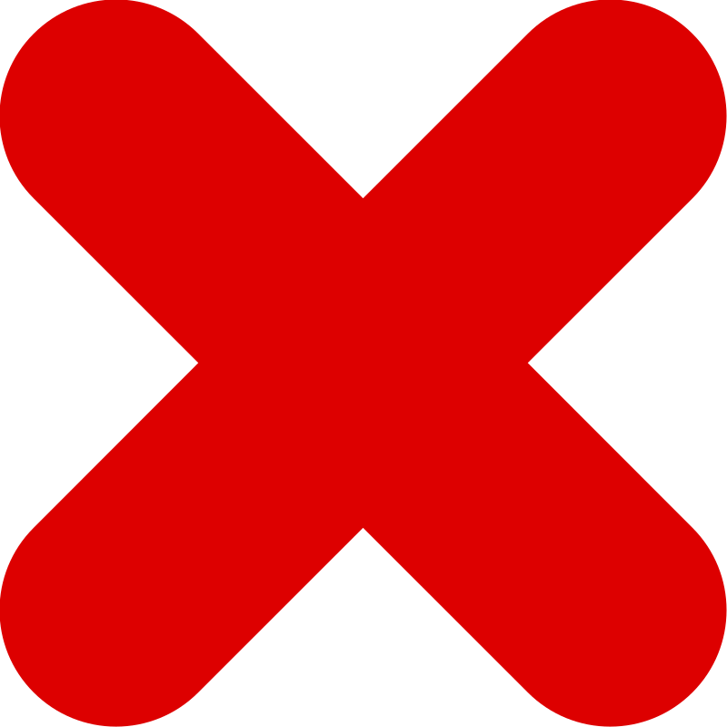

# TypeScript Code Conversion

This document contains the TypeScript versions of the original JavaScript files (`general.js`, `basicSettings.js`, `advanceSettings.js`, `main.js`).

## `general.ts`

```typescript

interface ComponentData {
  name: string;
  lightIntensity: number;
  numOfLights: number;
  isLightOn: boolean;
  autoOn: string;
  autoOff: string;
  usage: number[];
  element?: HTMLButtonElement | null;
}

interface WifiConnection {
  id: number;
  wifiName: string;
  signal: 'excellent' | 'good' | 'poor';
}

type ComponentsData = Record<string, ComponentData>;

const componentsData: ComponentsData = {
  hall: { name: 'hall', lightIntensity: 5, numOfLights: 6, isLightOn: false, autoOn: '06:30', autoOff: '22:00', usage: [22, 11, 12, 10, 12, 17, 22] },
  bedroom: { name: 'bedroom', lightIntensity: 5, numOfLights: 3, isLightOn: false, autoOn: '06:30', autoOff: '22:00', usage: [18, 5, 7, 5, 6, 6, 18] },
  bathroom: { name: 'bathroom', lightIntensity: 5, numOfLights: 1, isLightOn: false, autoOn: '06:30', autoOff: '22:00', usage: [2, 1, 1, 1, 1, 3, 3] },
  'outdoor lights': { name: 'outdoor lights', lightIntensity: 5, numOfLights: 6, isLightOn: false, autoOn: '06:30', autoOff: '22:00', usage: [15, 12, 13, 9, 12, 13, 18] },
  'guest room': { name: 'guest room', lightIntensity: 5, numOfLights: 4, isLightOn: false, autoOn: '06:30', autoOff: '22:00', usage: [12, 10, 3, 9, 5, 5, 18] },
  kitchen: { name: 'kitchen', lightIntensity: 5, numOfLights: 3, isLightOn: false, autoOn: '06:30', autoOff: '22:00', usage: [12, 19, 13, 11, 12, 13, 18] },
  'walkway & corridor': { name: 'walkway & corridor', lightIntensity: 5, numOfLights: 8, isLightOn: false, autoOn: '06:30', autoOff: '22:00', usage: [12, 19, 13, 15, 22, 23, 18] },
};

const wifiConnections: WifiConnection[] = [
  { id: 0, wifiName: 'Inet service', signal: 'excellent' },
  { id: 1, wifiName: 'Kojo_kwame121', signal: 'poor' },
  { id: 2, wifiName: 'spicyalice', signal: 'good' },
  { id: 3, wifiName: 'virus', signal: 'good' },
];


class General {
    protected componentsData: ComponentsData = componentsData;
    protected wifiConnections: WifiConnection[] = wifiConnections;

    public isLightOn: boolean;
    public lightIntensity: number;

    constructor() {
        this.isLightOn = false;
        this.lightIntensity = 5;
    }

    getComponent(name: string): ComponentData | undefined {
        return this.componentsData[name.toLowerCase()];
    }

    getWifi(): WifiConnection[] {
        return this.wifiConnections;
    }

    protected selector<T extends Element>(identifier: string): T | null {
        return document.querySelector<T>(identifier);
    }

    protected closestSelector<T extends Element>(
        selectedElement: Element,
        ancestorIdentifier: string,
        childSelector: string
    ): T | null {
        const closestAncestor = selectedElement.closest<HTMLElement>(ancestorIdentifier);
        return closestAncestor ? closestAncestor.querySelector<T>(childSelector) : null;
    }

    getSelectedComponentName(element: Element, ancestorIdentifier: string = '.rooms', elementSelector: string = 'p'): string | null {
        const selectedElement = this.closestSelector<HTMLParagraphElement>(element, ancestorIdentifier, elementSelector);
        return selectedElement ? selectedElement.textContent?.toLowerCase() ?? null : null;
    }

     getComponentData(element: Element, ancestorIdentifier: string, childElementSelector: string): ComponentData | undefined {
        const name = this.getSelectedComponentName(element, ancestorIdentifier, childElementSelector);
        return name ? this.getComponent(name) : undefined;
    }


    renderHTML(htmlString: string, position: InsertPosition, container: Element): void {
        container.insertAdjacentHTML(position, htmlString);
    }

    notification(message: string): string {
        return `
            <div class="notification">
                <p>${message}</p>
            </div>
        `;
    }

    displayNotification(message: string, position: InsertPosition, container: Element): void {
        const html = this.notification(message);
        this.renderHTML(html, position, container);
    }

    removeNotification(element: Element): void {
        setTimeout(() => {
            element.remove();
        }, 2000);
    }


    handleLightIntensity(element: HTMLElement, lightIntensity: number): void {
        const brightness = Math.max(0, Math.min(1, lightIntensity));
        element.style.filter = `brightness(${brightness})`;
    }

    updateComponentData(data: Partial<ComponentData>, componentName: string): void {
       const component = this.getComponent(componentName);
       if (component) {
           Object.assign(component, data);
           console.log(`Updated ${componentName}:`, component);
       } else {
            console.warn(`Component ${componentName} not found for update.`);
       }
    }

    updateMarkupValue(element: Element, value: string): void {
        element.textContent = value;
    }

    toggleHidden(element: Element): void {
        element.classList.toggle('hidden');
    }

    removeHidden(element: Element): void {
        element.classList.remove('hidden');
    }

    addHidden(element: Element): void {
        element.classList.add('hidden');
    }

    formatTextToClassName(name: string): string {
        return name.split(' ').join('_');
    }


    setComponentElement(roomData: ComponentData): void {
        if (roomData.element) return;

        let parent: HTMLElement | null = null;
        const roomName = roomData.name.toLowerCase();

        if (roomName === 'walkway & corridor') {
            parent = this.selector('.corridor');
        } else if (roomName === 'guest room') {
            const elementClassName = this.formatTextToClassName(roomName);
            parent = this.selector(`.${elementClassName}`);
        } else if (roomName === 'outdoor lights') {
            parent = this.selector('.outside_lights');
        } else {
             parent = this.selector(`.${this.formatTextToClassName(roomName)}`);
        }

        if (parent) {
            const buttonElement = parent.querySelector<HTMLButtonElement>('.light-switch');
            roomData.element = buttonElement;
             if (!buttonElement) {
                 console.warn(`Light switch button not found for room: ${roomData.name} in parent:`, parent);
            }
        } else {
            console.warn(`Parent element not found for room: ${roomData.name}`);
        }
    }
}

export default General;
export { ComponentData, WifiConnection, ComponentsData };
basicSettings.ts

import General, { ComponentData } from "./general.js";

class Light extends General {
    constructor() {
        super();
    }

    notification(message: string): string {
        return `
            <div class="notification">
                <div>
                    
                </div>
                <p>${message}</p>
            </div>
        `;
    }

    displayNotification(message: string, position: InsertPosition, container: Element): void {
        const html = this.notification(message);
        this.renderHTML(html, position, container);
        const notificationElement = container.lastElementChild;
        if (notificationElement) {
             this.removeNotification(notificationElement);
        }
    }

    removeNotification(element: Element): void {
        setTimeout(() => {
            element.remove();
        }, 5000);
    }

    private lightSwitchOn(lightButtonImage: HTMLImageElement): void {
        lightButtonImage.setAttribute('src', './assets/svgs/light_bulb.svg');
    }

    private lightSwitchOff(lightButtonImage: HTMLImageElement): void {
        lightButtonImage.setAttribute('src', './assets/svgs/light_bulb_off.svg');
    }

    private lightComponentSelectors(lightButtonElement: Element): {
        roomName: string | null;
        componentData: ComponentData | undefined;
        childImage: HTMLImageElement | null;
        background: HTMLImageElement | null;
    } {
        const roomName = this.getSelectedComponentName(lightButtonElement);
        const componentData = roomName ? this.getComponent(roomName) : undefined;
        const childImage = lightButtonElement.querySelector<HTMLImageElement>('img');
        const background = this.closestSelector<HTMLImageElement>(lightButtonElement, '.rooms', 'img.room_background');

        return { roomName, componentData, childImage, background };
    }

    toggleLightSwitch(lightButtonElement: HTMLButtonElement): void {
        const { componentData: component, childImage, background } = this.lightComponentSelectors(lightButtonElement);
        const slider = this.closestSelector<HTMLInputElement>(lightButtonElement, '.rooms', 'input[type="range"]#light_intensity');

        if (!component || !childImage || !background || !slider) {
            console.warn("Could not toggle light: Missing component data, image, background, or slider.", { component, childImage, background, slider });
            return;
        }

        component.isLightOn = !component.isLightOn;

        if (component.isLightOn) {
            this.lightSwitchOn(childImage);
            component.lightIntensity = component.lightIntensity > 0 ? component.lightIntensity : 5;
            const brightness = component.lightIntensity / 10;
            this.handleLightIntensity(background, brightness);
            slider.value = String(component.lightIntensity);
        } else {
            this.lightSwitchOff(childImage);
            this.handleLightIntensity(background, 0);
            slider.value = String(component.lightIntensity);
        }
    }

    handleLightIntensitySlider(sliderElement: HTMLInputElement, intensityStr: string): void {
        const { componentData, background, childImage } = this.lightComponentSelectors(sliderElement);
        const lightSwitchButton = this.closestSelector<HTMLButtonElement>(sliderElement, '.rooms', '.light-switch');


        const intensity = Number(intensityStr);
         if (isNaN(intensity) || !componentData || !background || !lightSwitchButton || !childImage) {
             console.warn("Invalid intensity or missing elements for slider.", { intensityStr, componentData, background, lightSwitchButton, childImage});
             return;
         }


        componentData.lightIntensity = intensity;
        const brightness = intensity / 10;

        this.handleLightIntensity(background, brightness);

        if (intensity === 0) {
            if (componentData.isLightOn) {
                 componentData.isLightOn = false;
                 this.lightSwitchOff(childImage);
            }
        } else {
             if (!componentData.isLightOn) {
                 componentData.isLightOn = true;
                 this.lightSwitchOn(childImage);
             }
        }
    }

    sliderLight(isLightOn: boolean, lightButtonElement: HTMLButtonElement): void {
        const { componentData: component, childImage, background } = this.lightComponentSelectors(lightButtonElement);

        if (!component || !childImage || !background) {
             console.warn("Could not update light from slider state: Missing component, image, or background.");
             return;
        }

        component.isLightOn = isLightOn;

        if (isLightOn) {
            this.lightSwitchOn(childImage);
            const brightness = component.lightIntensity / 10;
            this.handleLightIntensity(background, brightness);
        } else {
            this.lightSwitchOff(childImage);
            this.handleLightIntensity(background, 0);
        }
    }

}

export default Light;
advanceSettings.ts


import { Chart, ChartConfiguration, registerables } from 'chart.js/auto'; 
Chart.register(...registerables); 

import Light from './basicSettings.js';
import { ComponentData } from './general.js';


class AdvanceSettings extends Light {

    private activeChartInstance: Chart | null = null;

    constructor() {
        super();
    }

    private generateMarkup(component: ComponentData): string {
        const { name, numOfLights, autoOn, autoOff } = component;
        return `
        <div class="advanced_features">
            <button class="close-btn top-right-close"> 
            </button>
            <h3>Advanced features</h3>
            <section class="component_summary">
                <div>
                    <p class="component_name">${this.capFirstLetter(name)}</p>
                    <p class="number_of_lights">${numOfLights} Lights</p> </div>
                <div>
                    <p class="auto_on">
                        <span>Automatic turn on:</span>
                        <span>${autoOn || 'Not set'}</span> </p>
                    <p class="auto_off">
                        <span>Automatic turn off:</span>
                        <span>${autoOff || 'Not set'}</span> </p>
                </div>
            </section>
            <section class="customization">
                <div class="edit">
                    <p>Customize</p>
                    <button class="customization-btn" aria-label="Customize automatic settings"> 
                    </button>
                </div>
                <section class="customization-details hidden">
                    <h4>Automatic on/off settings</h4>
                    <div class="defaultOn setting-group"> <label for="autoOnTime">Turn on at:</label> <input type="time" name="autoOnTime" id="autoOnTime" value="${autoOn || ''}"> <div>
                            <button class="defaultOn-okay">Okay</button>
                            <button class="defaultOn-cancel">Cancel</button>
                        </div>
                    </div>
                    <div class="defaultOff setting-group"> <label for="autoOffTime">Turn off at:</label> <input type="time" name="autoOffTime" id="autoOffTime" value="${autoOff || ''}"> <div>
                            <button class="defaultOff-okay">Okay</button>
                            <button class="defaultOff-cancel">Cancel</button>
                        </div>
                    </div>
                </section>
            </section> <section class="summary">
                 <h3>Usage Summary (Last 7 Days)</h3>
                 <div class="chart-container" style="position: relative; height:200px; width:100%"> <canvas id="myChart"></canvas>
                 </div>
             </section>
            </div>
        `;
    }

    private displayUsageAnalytics(usageData: number[]): void {
        const ctx = this.selector<HTMLCanvasElement>('#myChart');
        if (!ctx) {
            console.error('Canvas element #myChart not found.');
            return;
        }

        if (this.activeChartInstance) {
            this.activeChartInstance.destroy();
            this.activeChartInstance = null;
        }


        const chartConfig: ChartConfiguration = {
            type: 'line',
            data: {
                labels: ['Sun', 'Mon', 'Tue', 'Wed', 'Thu', 'Fri', 'Sat'],
                datasets: [{
                    label: 'Hours of usage',
                    data: usageData,
                    borderColor: 'rgb(75, 192, 192)',
                    tension: 0.1
                }]
            },
            options: {
                responsive: true,
                maintainAspectRatio: false,
                scales: {
                    y: {
                        beginAtZero: true,
                        title: {
                             display: true,
                             text: 'Hours'
                         }
                    }
                },
                plugins: {
                     legend: {
                         position: 'top',
                     },
                     tooltip: {
                         enabled: true
                     }
                }
            }
        };

        this.activeChartInstance = new Chart(ctx, chartConfig);
    }


    modalPopUp(triggerElement: Element): void {
        const selectedRoomName = this.getSelectedComponentName(triggerElement);
        if (!selectedRoomName) {
            console.error("Could not determine room name from trigger element:", triggerElement);
            return;
        }

        const componentData = this.getComponent(selectedRoomName);
        if (!componentData) {
            console.error(`Component data not found for room: ${selectedRoomName}`);
            return;
        }

        const parentElement = this.selector<HTMLElement>('.advanced_features_container');
        if (!parentElement) {
            console.error('Advanced features container not found.');
            return;
        }

        parentElement.innerHTML = '';

        this.renderHTML(this.generateMarkup(componentData), 'afterbegin', parentElement);
        this.removeHidden(parentElement);

        const usage = Array.isArray(componentData.usage) ? componentData.usage : [];
        this.displayUsageAnalytics(usage);
    }

    displayCustomization(selectedElement: Element): void {
        const detailsSection = selectedElement.closest('.customization')?.querySelector<HTMLElement>('.customization-details');
        if (detailsSection) {
            this.toggleHidden(detailsSection);
        } else {
             console.warn("Could not find customization details section.");
        }
    }

    closeModalPopUp(): void {
        const parentElement = this.selector<HTMLElement>('.advanced_features_container');
        const childElement = this.selector<HTMLElement>('.advanced_features');

         if (this.activeChartInstance) {
            this.activeChartInstance.destroy();
            this.activeChartInstance = null;
        }


        if (childElement) {
             childElement.remove();
        }
        if (parentElement) {
             this.addHidden(parentElement);
        }
    }

    customizationCancelled(selectedElement: Element, parentSelectorIdentifier: string): void {
        const inputElement = this.closestSelector<HTMLInputElement>(selectedElement, parentSelectorIdentifier, 'input[type="time"]');
        if (inputElement) {
             const component = this.getComponentData(inputElement, '.advanced_features', '.component_name');
             if(component){
                 const originalValue = parentSelectorIdentifier === '.defaultOn' ? component.autoOn : component.autoOff;
                 inputElement.value = originalValue || '';
             } else {
                inputElement.value = '';
             }
        }
    }

    private updateAutoTime(selectedElement: Element, timeType: 'autoOn' | 'autoOff', parentSelector: '.defaultOn' | '.defaultOff'): void {
         const inputElement = this.closestSelector<HTMLInputElement>(selectedElement, parentSelector, 'input[type="time"]');
        if (!inputElement) return;

        const { value } = inputElement;

        // Validate the time value (basic check)
        if (!value || !/^\d{2}:\d{2}$/.test(value)) {
            console.warn("Invalid or empty time value provided.");
            // Optionally provide user feedback here
            return;
        }

        const component = this.getComponentData(inputElement, '.advanced_features', '.component_name');
        if (!component) {
            console.error("Could not find component data to update time.");
            return;
        }

        // Update component data
        component[timeType] = value;

        // Update the display in the summary section
        const displaySelector = timeType === 'autoOn' ? '.auto_on > span:last-child' : '.auto_off > span:last-child';
        const spanElement = this.selector<HTMLSpanElement>(displaySelector); // Query within the modal context if necessary
        if (spanElement) {
            this.updateMarkupValue(spanElement, value);
        } else {
             console.warn(`Could not find span element ('${displaySelector}') to update time display.`);
        }


        // Update room data (if separate from componentData - likely not needed if componentData is the source of truth)
        // this.setComponentElement(component); // Ensure element is associated if needed for automation

        console.log(`Set ${timeType} for ${component.name} to ${value}`);
        // Handle automation (scheduling the light toggle)
        // Note: The original `automateLight` logic might need adjustments for robustness.
        // It relies on `setInterval` checking every second, which isn't ideal for long periods.
        // Consider using `setTimeout` with the calculated time difference.
        this.scheduleLightAutomation(component);


        // Optional: Provide user feedback (e.g., display notification)
        // this.displayNotification(`${this.capFirstLetter(timeType)} time set to ${value}`, 'beforeend', document.body); // Example
    }

     customizeAutomaticOnPreset(selectedElement: Element): void {
        this.updateAutoTime(selectedElement, 'autoOn', '.defaultOn');
    }

    customizeAutomaticOffPreset(selectedElement: Element): void {
         this.updateAutoTime(selectedElement, 'autoOff', '.defaultOff');
    }

    // --- Utility and Automation Methods ---

    // Method to capitalize first letter (can be made static or moved to a utility file)
    capFirstLetter(word: string): string {
        if (!word) return '';
        return word.charAt(0).toUpperCase() + word.slice(1);
    }

    // Parses HH:MM string into a Date object set for today
    private formatTimeStringToDate(time: string): Date | null {
        if (!time || !/^\d{2}:\d{2}$/.test(time)) return null;
        const [hour, min] = time.split(':').map(Number);

        const targetTime = new Date();
        targetTime.setHours(hour, min, 0, 0); // Set hours, minutes, seconds, ms
        return targetTime;
    }

    // Calculates time difference in milliseconds
    private getTimeDifference(targetTime: Date): number {
        const now = new Date();
        let difference = targetTime.getTime() - now.getTime();

        // If the target time has already passed today, schedule it for tomorrow
        if (difference < 0) {
             targetTime.setDate(targetTime.getDate() + 1); // Move to tomorrow
             difference = targetTime.getTime() - now.getTime();
         }
        return difference;
    }


    // Placeholder for managing timeouts (replace simple variables with a more robust structure)
    private automationTimeouts: { [key: string]: { on?: number; off?: number } } = {};


    // Schedules the light on/off using setTimeout
    private scheduleLightAutomation(component: ComponentData): void {
         const componentKey = component.name.toLowerCase(); // Unique key for the component


         // Clear existing timeouts for this component
         if (this.automationTimeouts[componentKey]?.on) {
             clearTimeout(this.automationTimeouts[componentKey].on);
         }
         if (this.automationTimeouts[componentKey]?.off) {
             clearTimeout(this.automationTimeouts[componentKey].off);
         }
         this.automationTimeouts[componentKey] = {};


         // Ensure the component has its element associated
         this.setComponentElement(component);
         const lightElement = component.element;


         if (!lightElement) {
             console.warn(`Cannot automate ${component.name}: light element not found.`);
             return;
         }


         // Schedule 'ON' time
         const onTimeDate = this.formatTimeStringToDate(component.autoOn);
         if (onTimeDate) {
             const onDifference = this.getTimeDifference(onTimeDate);
             if (onDifference > 0) {
                 console.log(`Scheduling ${component.name} to turn ON in ${onDifference / 1000}s`);
                 this.automationTimeouts[componentKey].on = window.setTimeout(() => {
                     // Check if light is already on before toggling
                     const currentComponentState = this.getComponent(component.name);
                      if (currentComponentState && !currentComponentState.isLightOn) {
                           console.log(`Auto turning ON ${component.name}`);
                           this.toggleLightSwitch(lightElement); // Toggle should handle turning it on
                      }
                     // Reschedule for the next day
                     this.scheduleLightAutomation(component);
                 }, onDifference);
             }
         }


         // Schedule 'OFF' time
         const offTimeDate = this.formatTimeStringToDate(component.autoOff);
         if (offTimeDate) {
             const offDifference = this.getTimeDifference(offTimeDate);
             if (offDifference > 0) {
                  console.log(`Scheduling ${component.name} to turn OFF in ${offDifference / 1000}s`);
                 this.automationTimeouts[componentKey].off = window.setTimeout(() => {
                      // Check if light is already off before toggling
                      const currentComponentState = this.getComponent(component.name);
                      if (currentComponentState && currentComponentState.isLightOn) {
                            console.log(`Auto turning OFF ${component.name}`);
                            this.toggleLightSwitch(lightElement); // Toggle should handle turning it off
                      }
                      // Reschedule for the next day
                     this.scheduleLightAutomation(component);
                 }, offDifference);
             }
         }
    }


}

export default AdvanceSettings;
main.ts// main.ts

// Import classes
import Light from './basicSettings.js'; // Assuming default exports
import AdvanceSettings from './advanceSettings.js';

// Type assertions for elements known to exist, or check for null
const homepageButton = document.querySelector<HTMLButtonElement>('.entry_point');
const homepage = document.querySelector<HTMLElement>('main');
const mainRoomsContainer = document.querySelector<HTMLElement>('.application_container');
const advanceFeaturesContainer = document.querySelector<HTMLElement>('.advanced_features_container');
const nav = document.querySelector<HTMLElement>('nav');
const loader = document.querySelector<HTMLElement>('.loader-container');

// Ensure elements exist before proceeding
if (!homepageButton || !homepage || !mainRoomsContainer || !advanceFeaturesContainer || !nav || !loader) {
    console.error("Initialization failed: One or more essential elements not found.");
    // Potentially throw an error or display a message to the user
    // throw new Error("Initialization failed: Missing essential elements.");
} else {
    // Object creation with types
    const lightController: Light = new Light();
    const advancedSettings: AdvanceSettings = new AdvanceSettings();

    // Global variables (if needed, otherwise manage state within classes)
    // let selectedComponent: ComponentData | undefined; // Example if needed
    // let isWifiActive: boolean = true; // Example if needed


    // --- Event Handlers ---

    // Hide homepage after button is clicked
    homepageButton.addEventListener('click', (e: MouseEvent) => {
        lightController.addHidden(homepage);
        lightController.removeHidden(loader); // Show loader

        // Use setTimeout with type safety
        window.setTimeout(() => {
            lightController.addHidden(loader); // Hide loader after delay
            lightController.removeHidden(mainRoomsContainer); // Show main content
            lightController.removeHidden(nav); // Show nav
        }, 1000);
    });


    // Event delegation for main room controls
    mainRoomsContainer.addEventListener('click', (e: MouseEvent) => {
        // Use `currentTarget` for the element the listener is attached to,
        // and `target` for the element that was actually clicked.
        const targetElement = e.target as Element; // Type assertion

        // When click occurs on light switch button (target the button or its image)
        const lightSwitchButton = targetElement.closest<HTMLButtonElement>(".light-switch");
        if (lightSwitchButton) {
            lightController.toggleLightSwitch(lightSwitchButton);
            return; // Handled
        }

        // When click occurs on advance modal trigger button
        const advancedSettingsBtn = targetElement.closest<HTMLButtonElement>('.advance-settings_modal');
        if (advancedSettingsBtn) {
            advancedSettings.modalPopUp(advancedSettingsBtn);
            return; // Handled
        }
    });

    // Event delegation for slider changes
    mainRoomsContainer.addEventListener('change', (e: Event) => {
        // Ensure the target is an HTMLInputElement
        if (e.target instanceof HTMLInputElement && e.target.type === 'range' && e.target.id === 'light_intensity') {
             const slider = e.target;
             const value = slider.value; // Value is string
             lightController.handleLightIntensitySlider(slider, value);
        }
    });

    // Event delegation for advanced settings modal controls
    advanceFeaturesContainer.addEventListener('click', (e: MouseEvent) => {
        const targetElement = e.target as Element; // Type assertion

        // Close button (check for specific class if needed)
        if (targetElement.closest('.close-btn')) {
            advancedSettings.closeModalPopUp();
            return;
        }

        // Display customization section
        const customizationBtn = targetElement.closest<HTMLButtonElement>('.customization-btn');
        if (customizationBtn) {
            advancedSettings.displayCustomization(customizationBtn);
            return;
        }

        // Set light ON time customization confirmation
        if (targetElement.matches('.defaultOn-okay')) {
             advancedSettings.customizeAutomaticOnPreset(targetElement);
             return;
        }

        // Set light OFF time customization confirmation
        if (targetElement.matches('.defaultOff-okay')) {
             advancedSettings.customizeAutomaticOffPreset(targetElement);
             return;
        }

        // Cancel buttons for time customization
        if (targetElement.matches('.defaultOn-cancel')) {
            advancedSettings.customizationCancelled(targetElement, '.defaultOn');
            return;
        }
        if (targetElement.matches('.defaultOff-cancel')) {
            advancedSettings.customizationCancelled(targetElement, '.defaultOff');
            return;
        }
    });

     

} 

